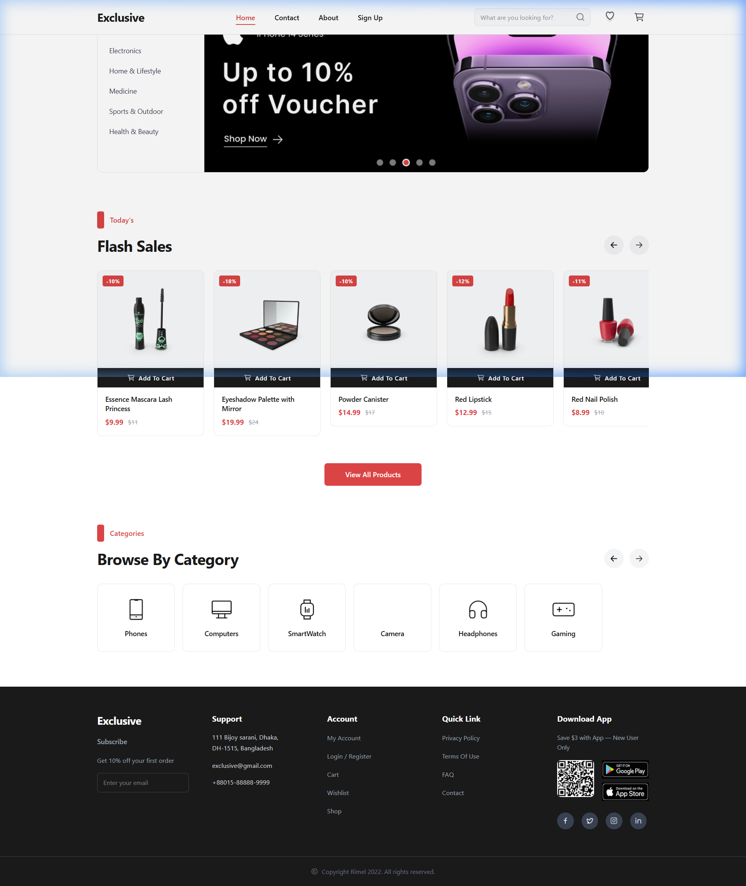
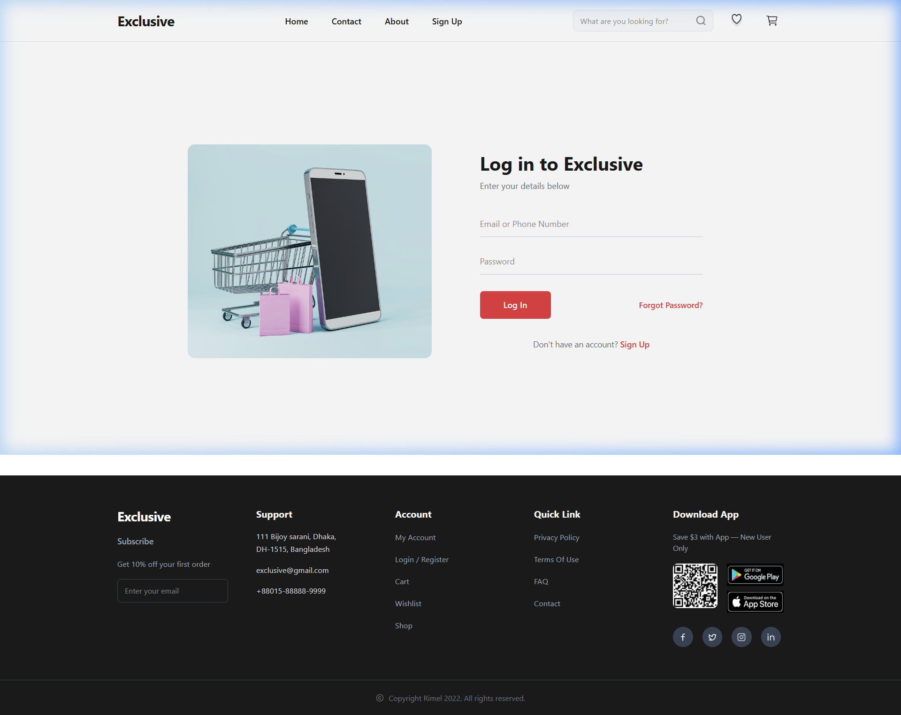
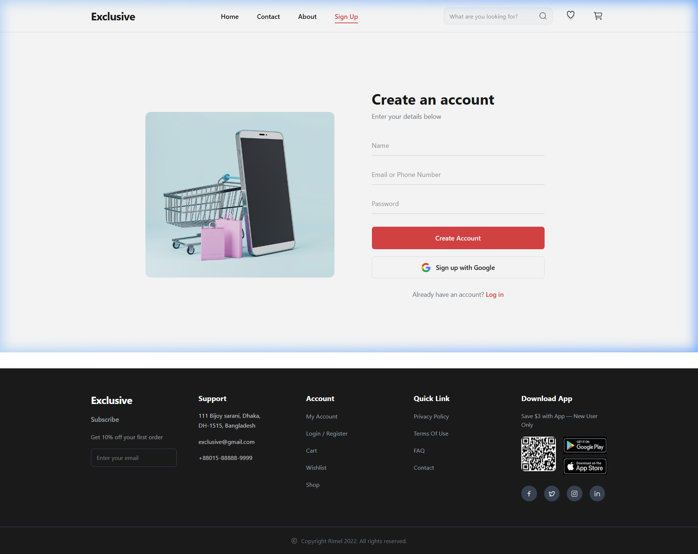
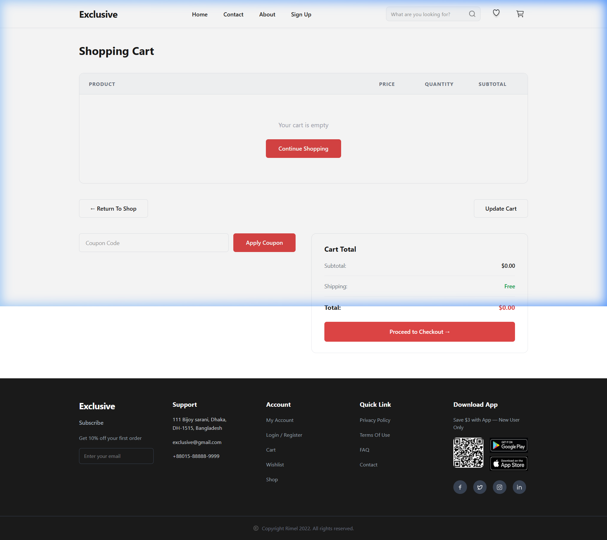
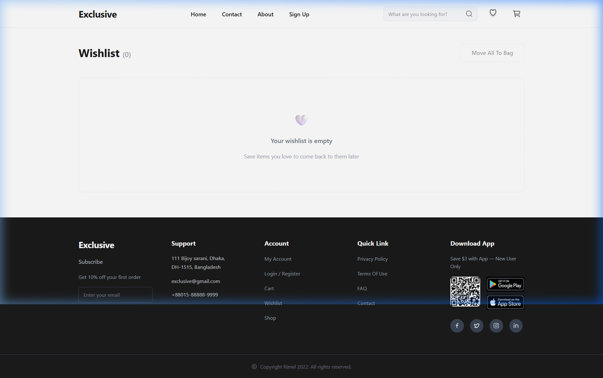

# 🛍️ Exclusive — E-Commerce Web App

A modern, fully responsive e-commerce frontend built with **React 19**, **Vite**, and **TailwindCSS v4**. Browse products, manage your wishlist, and add items to cart — all powered by a live product API.

---

## 📸 Screenshots

### 🏠 Home Page — Hero Banner + Flash Sales


### 🔐 Login Page


### 📝 Sign Up Page


### 🛒 Shopping Cart


### ❤️ Wishlist


---

## ✨ Features

| Feature | Description |
|---|---|
| **Hero Banner** | iPhone 14 promotional banner with category sidebar navigation |
| **Flash Sales** | Horizontally scrollable product strip with discount badges and scroll arrows |
| **Browse by Category** | Icon-based category grid (Phones, Computers, SmartWatch, Camera, Headphones, Gaming) |
| **Product Cards** | Product image, name, price, discount badge, and Add to Cart / wishlist actions |
| **Product Detail** | Full product page with images, rating, stock status, and add-to-cart |
| **Shopping Cart** | Persistent cart via `localStorage`, quantity tracking, subtotal/shipping/total calc |
| **Wishlist** | Save items, remove from list, move to cart with duplicate prevention |
| **Checkout** | Checkout placeholder page (implementation in progress) |
| **404 Page** | Custom Not Found page with home redirect |
| **Footer** | Full-featured footer with newsletter, social links, app download QR codes |

---

## 🧱 Tech Stack

| Layer | Technology |
|---|---|
| **Framework** | [React 19](https://react.dev/) |
| **Build Tool** | [Vite 7](https://vitejs.dev/) |
| **Routing** | [React Router DOM v7](https://reactrouter.com/) |
| **Styling** | [TailwindCSS v4](https://tailwindcss.com/) (via `@tailwindcss/vite`) |
| **State Management** | [Zustand v5](https://github.com/pmndrs/zustand) + `localStorage` for persistence |
| **Product API** | [DummyJSON](https://dummyjson.com/) (mock REST API) |
| **Linting** | ESLint 9 with React Hooks + React Refresh plugins |

---

## 📁 Project Structure

```
e-commerce-app/
├── .env                    # Backend environment variables (never commit)
├── .env.example            # Safe template — commit this
├── .gitignore
│
└── frontend/               # React + Vite application
    ├── .env                # Vite environment variables (never commit)
    ├── .env.example        # Safe template — commit this
    ├── vite.config.js
    ├── index.html
    │
    └── src/
        ├── main.jsx            # App entry point
        ├── App.jsx             # Route definitions
        ├── index.css           # Global styles + design tokens
        │
        ├── pages/
        │   ├── HomePage.jsx    # Hero, Flash Sales, Categories
        │   ├── Login.jsx       # Login form with illustration
        │   ├── SignUp.jsx      # Registration + Google sign-in
        │   ├── ProductDetail.jsx  # Single product view
        │   ├── Cart.jsx        # Shopping cart with totals
        │   ├── WishList.jsx    # Saved wishlist items
        │   ├── CheckOut.jsx    # Checkout (coming soon)
        │   └── Error404.jsx    # 404 Not Found page
        │
        ├── components/
        │   ├── Navbar.jsx      # Top navigation bar
        │   ├── Footer.jsx      # Footer with newsletter + links
        │   ├── ProductCard.jsx # Reusable product tile
        │   ├── CartItemStrip.jsx  # Cart row item
        │   └── index.js        # Barrel export
        │
        ├── hooks/
        │   ├── useProducts.js  # Fetch paginated product list
        │   ├── useProduct.js   # Fetch single product by ID
        │   └── index.js        # Barrel export
        │
        ├── layouts/
        │   └── MainLayout.jsx  # Shared Navbar + Footer wrapper
        │
        ├── features/           # Zustand store slices (state management)
        ├── utils/
        │   └── localstorage.js # getFromLocalStorage / saveToLocalStorage helpers
        └── assets/
            └── icons/          # SVGs, images, and icon barrel export
```

---

## 🚀 Getting Started

### Prerequisites

- [Node.js](https://nodejs.org/) v18 or higher
- npm v9 or higher

### 1. Clone the repository

```bash
git clone https://github.com/Sadbhavcodes/E-commerce-website-full-stack-.git
cd E-commerce-website-full-stack-
```

### 2. Install dependencies & run

```bash
cd frontend
npm install
npm run dev
```

The app will be running at **http://localhost:5173** 🎉

---

## 🌐 Available Routes

| Route | Page | Description |
|---|---|---|
| `/` | Home | Hero banner, Flash Sales, Browse by Category |
| `/login` | Login | Email/password login form |
| `/signup` | Sign Up | Account creation + Google sign-in |
| `/product/:id` | Product Detail | Full product info with add-to-cart |
| `/cart` | Shopping Cart | Cart items, coupon, order summary |
| `/wishlist` | Wishlist | Saved products, move to cart |
| `/checkout` | Checkout | Order placement (coming soon) |
| `*` | 404 Not Found | Custom error page |

## 🧠 Custom Hooks

### `useProducts({ limit, skip })`
Fetches a paginated list of products from the API. Returns `{ products, loading, error }`.

```js
const { products, loading, error } = useProducts({ limit: 10 });
```

### `useProduct()`
Reads the product `id` from the URL params and fetches a single product. Returns `{ product, loading, error }`.

```js
const { product, loading, error } = useProduct(); // uses useParams() internally
```

---

## 🗄️ State & Persistence

Cart and Wishlist are persisted in **`localStorage`** using two utility helpers:

```js
import { saveToLocalStorage, getFromLocalStorage } from "./utils/localstorage";

// Save
saveToLocalStorage("cart", updatedCart);

// Read (returns [] if empty or parse fails)
const cart = getFromLocalStorage("cart");
```

Global state is managed via **Zustand** stores (located in `src/features/`).

## 🗺️ Roadmap

- [x] Home page with Hero + Flash Sales + Categories
- [x] Product detail page
- [x] Shopping cart with localStorage persistence
- [x] Wishlist with move-to-cart
- [x] Login and Sign Up UI
- [ ] Authentication (JWT-based backend)
- [ ] Checkout flow with payment (Stripe)
- [ ] Search functionality
- [ ] Product filtering & sorting
- [ ] User account & order history
- [ ] Backend API (Node.js + Express + MongoDB)


<p align="center">Built with ❤️ using React + Vite</p>